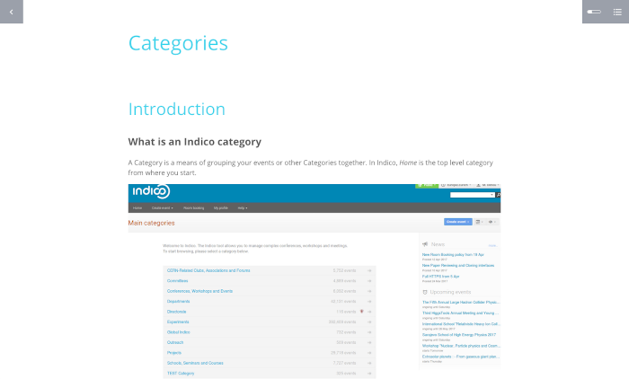

# Indico E-Learning Course

This tool builds Indico's e-learning documentation from the
[end-user documentation repo](https://github.com/indico/indico-user-docs), using the
[Adapt](https://www.adaptlearning.org/) framework. The end result is a SCORM package which can be imported into most
modern e-learning platforms. The latest SCORM package can be found in the
[Releases](https://github.com/indico/indico-course/releases) page.

## Intellectual Property

A substantial part of the code in this repository (mainly `grunt` directory) is taken from the Adapt Framework.
All Adapt-related code licensed under the [GPLv3](https://www.gnu.org/licenses/gpl-3.0.en.html) license.

Code created by CERN (e.g. Markdown to adapt converter) is provided under the
[MIT](https://opensource.org/licenses/MIT) license. Documentation and
educational content is provided under a
[Create Commons Attribution 4.0 International (CC BY 4.0)](https://creativecommons.org/licenses/by/4.0/)
license.
